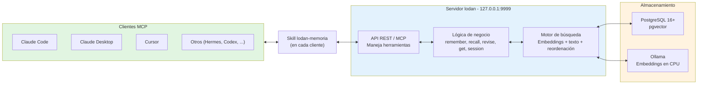

# lodan

Memoria persistente local para asistentes de IA. Guarda decisiones, preferencias, hechos y eventos en una base de datos, recupera lo que importa en una sola consulta, y funciona solo en tu máquina (localhost). Soporta Linux, macOS y Windows.

## Tabla de contenidos

- [¿Qué es lodan?](#qué-es-lodan)
- [Requisitos previos](#requisitos-previos)
- [Instalación](#instalación)
- [Uso básico](#uso-básico)
- [Comandos CLI](#comandos-cli)
- [Backup y Restauración](#backup-y-restauración)
- [Documentación técnica](#documentación-técnica)
- [Arquitectura](#arquitectura)
- [Estructura del proyecto](#estructura-del-proyecto)
- [Licencia](#licencia)

## ¿Qué es lodan?

lodan resuelve un problema de contexto: cuando trabajas con varios asistentes de IA (Claude, Cursor, Hermes, otros), cada uno olvida lo que pasó al cerrar la sesión. Información importante — decisiones de proyecto, preferencias personales, hechos que debería recordar — se pierde o hay que repetirla.

lodan mantiene **una sola memoria compartida** en tu máquina. Los asistentes guardan lo que importa mediante la skill `lodan-memoria`, y recuperan el contexto relevante en una sola consulta, sin límite de escala (de 10 registros a 10 millones).

**Características:**
- Búsqueda por significado + búsqueda de texto, combinadas (embeddings + reordenación rápida).
- Recuperación en <300 ms incluso con millones de registros.
- Funciona solo en localhost: privado, sin red, seguro.
- Instalación automática en Windows, Linux y macOS (ARM64, Intel, Apple Silicon).
- Compatibilidad: Claude Code, Claude Desktop, Cursor, Codex, Hermes, o cualquier cliente MCP.

---

## Requisitos previos

- **Go** ≥ 1.25.0 (para compilar desde fuente)
- **PostgreSQL** ≥ 16 con extensión `pgvector` ≥ 0.7.0
- **Ollama** (para embeddings; opcional si usas búsqueda de texto solamente)
- **SQLc** (para generar código desde SQL; necesario si modificas queries)

Los instaladores (`install`, `doctor`, `uninstall`) descargan y configuran PostgreSQL y Ollama automáticamente si no existen.

---

## Instalación

### Linux

```bash
cd /home/antonio/lodan
go build ./cmd/lodan

# Primera vez: inicializar base de datos y servicios
./lodan install

# Verificar la instalación
./lodan doctor

# Arrancar el servidor
./lodan serve
```

### macOS

```bash
cd /path/to/lodan
go build ./cmd/lodan

# Primera vez: inicializar base de datos y servicios
./lodan install

# Verificar la instalación
./lodan doctor

# Arrancar el servidor
./lodan serve
```

### Windows

```powershell
cd C:\path\to\lodan
go build .\cmd\lodan

# Primera vez: inicializar base de datos y servicios
.\lodan install

# Verificar la instalación
.\lodan doctor

# Arrancar el servidor
.\lodan serve
```

---

## Uso básico

Una vez que el servidor está en marcha (`lodan serve`), se escucha en `127.0.0.1:9999`. Los clientes MCP acceden a través de la skill `lodan-memoria`:

```bash
# En cualquier sesión de Claude, Cursor, etc., invoca la skill:
/lodan-memoria

# O directamente:
remember "decidí cambiar el servidor a Go 1.27"
recall "decisiones sobre migraciones"
```

La skill maneja el protocolo MCP; tú solo usas comandos en lenguaje natural.

---

## Comandos CLI

Tabla de comandos disponibles:

| Comando | Descripción | Ejemplo |
| :--- | :--- | :--- |
| `serve` | Arranca el servidor en `127.0.0.1:9999` | `./lodan serve` |
| `db` | Gestiona la base de datos (crear, conectar, consultar) | `./lodan db status` |
| `migrate` | Ejecuta migraciones de esquema | `./lodan migrate up` |
| `status` | Muestra estado del servidor y servicios | `./lodan status` |
| `bench` | Ejecuta benchmark de rendimiento (10k, 1M, 10M registros) | `./lodan bench` |
| `install` | Descarga y configura PostgreSQL, Ollama, skill (primera vez) | `./lodan install` |
| `doctor` | Verifica que todo funciona (PostgreSQL, Ollama, conectividad) | `./lodan doctor` |
| `uninstall` | Desinstala servicios y limpia la configuración | `./lodan uninstall` |

---

## Backup y Restauración

lodan permite crear backups de la base de datos con tres estrategias: **full** (copia completa), **differential** (cambios desde el último full) e **incremental** (cambios desde el último backup de cualquier tipo). Los backups se almacenan como archivos `.tar.zst` (tar comprimido con zstd).

### Tipos de backup

- **Full (`--full`):** Copia completa de todos los datos. Base para backups posteriores. Defecto si no especificas nada.
- **Differential (`--differential`):** Copia solo los archivos modificados desde el último backup **full** del destino. Opción intermedia en tamaño y velocidad.
- **Incremental (`--incremental`):** Copia solo los archivos modificados desde el último backup **de cualquier tipo** (full, incremental o differential) del destino. Es el más rápido y compacto.

Differential e incremental necesitan un backup full previo en el destino; sin él fallan con un error claro.

### Ejemplos de uso

#### Crear backups

```bash
# Full backup (por defecto)
./lodan db backup --to /backups

# Differential (requiere un full previo)
./lodan db backup --to /backups --differential

# Incremental (requiere un full previo)
./lodan db backup --to /backups --incremental
```

Los archivos se guardan con nombre: `lodan_backup_YYYY-MM-DD_HHMMSS.{full|diff|incr}.tar.zst`

#### Restaurar desde un archivo específico

```bash
# Restaurar desde un backup específico (full)
./lodan db restore --from /backups/lodan_backup_2026-10-01_120000.full.tar.zst
```

#### Restauración automática

```bash
# Auto-detecta el backup más reciente y restaura (full → incremental/differential)
./lodan db restore --from /backups
```

Cuando restauras desde un directorio sin especificar archivo, lodan ordena los backups por fecha (RFC3339Nano en `info.txt`), elige el full más reciente y aplica los incrementales/diferenciales posteriores de forma secuencial.

Cada backup incluye un manifiesto (`manifest.txt`) con la lista completa de lo que contenía el clúster en ese momento. Al restaurar, lodan extrae toda la cadena a un directorio temporal, borra de él lo que el manifiesto del último backup no lista (archivos eliminados desde el full) y comprueba que no falta nada ni cambia de tipo o tamaño. Si algo no cuadra, aborta sin tocar el clúster actual.

### Advertencia de downtime

**Durante un backup, el servidor se detiene solo mientras se copian los datos a un directorio temporal dentro del destino** (`.lodan_backup_<fecha>.<tipo>.staging`, que se borra siempre al terminar). La parada dura lo que tarda esa copia sin comprimir; la compresión zstd se hace después, con PostgreSQL ya en marcha. Por eso el destino necesita espacio libre para una copia sin comprimir de lo que se respalda. Durante la parada, y durante una restauración, los clientes MCP no pueden conectar. Planifica backups en momentos de baja actividad si es crítico.

### Retención de backups

La gestión automática de retención (eliminar backups antiguos) se implementará mediante un script bash en futuro. Por ahora, mantén el directorio de backups manualmente.

---

## Documentación técnica

La documentación técnica completa está en [`specs/PRD.md`](specs/PRD.md):
- Problema y contexto (por qué lodan existe)
- Objetivos y métricas de éxito
- Alcance (qué está incluido y qué no)
- Arquitectura de base de datos y búsqueda
- Especificaciones por funcionalidad (en `specs/NNN-*/`)

También ver [`CODEBASE.md`](CODEBASE.md) para el estado actual de cada módulo.

### Herramientas MCP

lodan expone **máximo 6 herramientas** vía MCP:

1. **`remember`** — Guarda un registro (decisión, hecho, evento, preferencia, nota)
2. **`recall`** — Busca registros por tema en lenguaje natural
3. **`revise`** — Actualiza o marca un registro como obsoleto
4. **`get`** — Obtiene un registro específico por ID
5. **`session`** — Maneja sesiones (inicio, cierre, resumen)
6. **`status`** — Verifica que el servidor está activo

Cada respuesta es compacta (sin JSON verboso) y optimizada para tokens.

### Búsqueda

lodan combina dos estrategias de búsqueda:

- **Por significado (embeddings):** Ollama genera embeddings; pgvector busca los k vecinos más cercanos en la métrica de coseno.
- **Por texto:** Búsqueda de subcadenas rápida en campos clave (resumen, tema).

La reordenación combina ambos resultados y devuelve los N primeros (<300 ms de p95).

### Ejemplos de uso real

```bash
# Guardar una decisión
remember "decidí cambiar la estructura de carpetas a screaming architecture"

# Recuperar contexto sobre un tema
recall "decisiones sobre arquitectura del proyecto"

# Ver la última sesión
session last

# Revisar un registro (marcar como sustituido)
revise "id-del-registro" --status sustituido
```

---

## Arquitectura



**Flujo:**
1. Un cliente (Claude, Cursor, etc.) llama a la skill `lodan-memoria`.
2. La skill usa el protocolo MCP para conectar con el servidor en `127.0.0.1:9999`.
3. El servidor procesa `remember`, `recall`, `revise`, etc.
4. La búsqueda consulta PostgreSQL (texto + embeddings vía pgvector) y Ollama (cálculo de embeddings).
5. Respuesta compacta de vuelta al cliente.

---

## Estructura del proyecto

```
lodan/
├── cmd/lodan/              # CLI principal (serve, db, migrate, status, bench, install, doctor, uninstall)
├── internal/
│   ├── memory/             # Guardar registros (remember)
│   ├── recall/             # Búsqueda por tema (recall, get)
│   ├── topic/              # Gestión de etiquetas y temas
│   ├── session/            # Sesiones (inicio, cierre, resumen)
│   ├── embedding/          # Cálculo y búsqueda de embeddings (Ollama)
│   ├── mcptools/           # Definición de herramientas MCP
│   ├── database/           # Conexión a PostgreSQL, pool de conexiones
│   └── config/             # Configuración (puertos, paths, autenticación)
├── specs/
│   ├── PRD.md              # Especificación de producto
│   └── NNN-*/              # Especificaciones por funcionalidad
├── go.mod, go.sum          # Dependencias de Go
├── Makefile                # Build, test, lint, etc. (si existe)
└── README.md               # Este archivo
```

Tests: están colocados junto al código como `*_test.go` (convención de Go). Los tests que necesitan base de datos arrancan un PostgreSQL temporal.

---

## Licencia

lodan **no tiene licencia formal asignada aún**. El código es privado del usuario (Antonio) y no está distribuido públicamente. Si tienes intención de distribuir lodan o usarlo en un contexto no personal, consulta sobre la licencia.

---

## Contribución

Este es un proyecto personal. Las sugerencias, reportes de bugs y PRs se reciben en el repositorio; ver [`AGENTS.md`](AGENTS.md) para el flujo de desarrollo y las skills obligatorias (`sdd`, `usar-git`, `screaming-architecture`, `lodan-memoria`).

---

**Última actualización:** 2026-09-30  
**Repositorio:** https://github.com/4ntoniomj/lodaan-memory  
**Autor:** Antonio (con Claude como orquestador)
