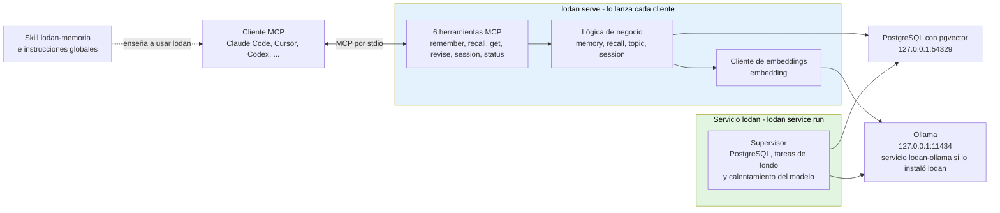

# lodan

Memoria persistente local para asistentes de IA. Guarda decisiones, preferencias, hechos y eventos en una base de datos, recupera lo que importa en una sola consulta, y funciona solo en tu máquina (localhost). Pensado para Linux, macOS y Windows; el estado real de cada sistema está en [Estado del proyecto](#estado-del-proyecto).

## Tabla de contenidos

- [¿Qué es lodan?](#qué-es-lodan)
- [Requisitos previos](#requisitos-previos)
- [Instalación](#instalación)
- [Uso básico](#uso-básico)
- [Comandos CLI](#comandos-cli)
- [Backup y Restauración](#backup-y-restauración)
- [Documentación técnica](#documentación-técnica)
- [Arquitectura](#arquitectura)
- [Estado del proyecto](#estado-del-proyecto)
- [Estructura del proyecto](#estructura-del-proyecto)
- [Licencia](#licencia)
- [Contribución](#contribución)

## ¿Qué es lodan?

lodan resuelve un problema de contexto: cuando trabajas con varios asistentes de IA (Claude, Cursor, Hermes, otros), cada uno olvida lo que pasó al cerrar la sesión. Información importante — decisiones de proyecto, preferencias personales, hechos que debería recordar — se pierde o hay que repetirla.

lodan mantiene **una sola memoria compartida** en tu máquina. Los asistentes guardan lo que importa mediante la skill `lodan-memoria` y las herramientas MCP de lodan, y recuperan el contexto relevante en una sola consulta. La escala medida llega a 1 millón de registros en una máquina de 8 GB de RAM; a 10 millones no se cumple el objetivo de latencia en esa máquina (ver [Estado del proyecto](#estado-del-proyecto)).

**Características:**
- Búsqueda por significado + búsqueda de texto, combinadas (embeddings + reordenación con el vector completo).
- Búsqueda en la base de datos con p95 de 66,9 ms a 1 millón de registros (400 candidatos, máquina de 8 GB). El cálculo del embedding de la consulta es un coste fijo aparte, que no depende del número de registros.
- Funciona solo en localhost: privado, sin red, seguro.
- Instalación con un solo comando (`lodan install`) en Linux, macOS y Windows. Plataformas objetivo según el PRD: Windows x64, Linux x64/ARM64 y macOS Intel/Apple Silicon.
- Configura automáticamente los clientes MCP que detecta en tu equipo: Claude Code, Claude Desktop (solo macOS y Windows), Cursor, Codex, Gemini CLI, Windsurf, VS Code, Hermes, opencode, Zed y LM Studio. Cualquier otro cliente MCP puede usar lodan configurándolo a mano (`lodan serve` por stdio, o HTTP local con `lodan serve --http`).

---

## Requisitos previos

Para compilar y ejecutar lodan solo necesitas:

- **Go** ≥ 1.25.0 (mínimo de `go.mod`). `go.mod` fija además `toolchain go1.27.1`: con `GOTOOLCHAIN=auto` (valor por defecto) Go la descarga sola.
- Conexión a internet durante `lodan install`, que descarga lo que falte (ver abajo).

PostgreSQL y Ollama **no** son requisitos previos: los aporta `lodan install`.

- **PostgreSQL ≥ 16 con pgvector ≥ 0.7.0:** `lodan install` los descarga con micromamba (desde conda-forge, comprobando su SHA-256) a la carpeta de datos de lodan, sin tocar el PostgreSQL del sistema.
- **Ollama** (calcula los embeddings): si ya hay uno respondiendo en la URL configurada, `lodan install` lo reutiliza. Si no, pide confirmación y descarga el suyo (unos 1,5 GB; unos 160 MB en macOS) y lo registra como servicio `lodan-ollama`. No lo descarga con `--skip-ollama` ni con `--skip-service`. Sin embeddings, lodan sigue guardando (el embedding queda pendiente) y busca solo por texto.
- Para los tests: los que necesitan base de datos arrancan un PostgreSQL temporal y requieren binarios de PostgreSQL ≥ 16 con pgvector ≥ 0.7.0 (`pg_config` en el `PATH` o `LODAN_PG_BIN_DIR`); si no los hay, se saltan con aviso.

No se necesita ninguna herramienta de generación de código ni `Makefile`: se compila con `go build`.

---

## Instalación

El flujo es el mismo en los tres sistemas: compila con Go y ejecuta `lodan install`. Desde la raíz del repositorio:

### Linux

```bash
go build ./cmd/lodan

# Instalar (pide sudo solo para registrar los servicios)
./lodan install

# Verificar la instalación
./lodan doctor
```

### macOS

```bash
go build ./cmd/lodan

# Instalar (pide sudo solo para registrar los servicios)
./lodan install

# Verificar la instalación
./lodan doctor
```

macOS está compilado y probado solo en unidad: no se ha instalado de verdad en un Mac (ver [Estado del proyecto](#estado-del-proyecto)).

### Windows

Desde una terminal de Windows (PowerShell), no desde WSL:

```powershell
go build .\cmd\lodan

# Instalar (el paso de los servicios pide administrador con UAC)
.\lodan install

# Verificar la instalación
.\lodan doctor
```

Notas de Windows, verificadas en la prueba real:
- Instala y desinstala desde una terminal de Windows. Lanzado desde WSL, el UAC se cancela sin mostrarse.
- Si instalas lodan a la vez en WSL y en Windows, ambos usan `127.0.0.1:54329` (PostgreSQL) y `127.0.0.1:11434` (Ollama), y el relé de localhost de WSL hace que el que arranca primero se quede el puerto.

### Qué hace `lodan install`

Ocho pasos, en este orden. Los tres primeros son críticos (si uno falla, la instalación se detiene); el resto informa del fallo y continúa. Es idempotente: repetirlo no duplica nada.

1. **Binario estable:** copia el ejecutable a `<datos>/bin/lodan` (`lodan.exe` en Windows) y, en Linux y macOS, crea el enlace `~/.local/bin/lodan` si esa carpeta existe y no hay otro archivo con ese nombre.
2. **PostgreSQL y pgvector:** los descarga con micromamba a `<datos>/runtime` y guarda su ruta en `config.json`.
3. **Base de datos:** inicializa el clúster, crea la base `lodan` y aplica las migraciones.
4. **Ollama:** reutiliza el que responda o descarga el de lodan (con confirmación).
5. **Servicios del sistema:** registra y arranca el servicio `lodan` (`lodan service run`) y, si instaló Ollama, `lodan-ollama`. Es el único paso que pide permisos de administrador (`sudo` en Linux y macOS, UAC en Windows). Los gestores son systemd (Linux), LaunchDaemon (macOS) y el SCM (Windows).
6. **Modelo de embeddings:** descarga en Ollama el modelo configurado (por defecto `embeddinggemma:300m-qat-q4_0`) si falta.
7. **Clientes MCP:** añade la entrada `lodan` a los clientes que detecta (solo si existe la carpeta de su aplicación; Claude Code se detecta por `~/.claude.json` o por el CLI `claude`), tras pedir confirmación y guardando una copia `.bak-lodan` del archivo.
8. **Skill e instrucciones:** copia la skill `lodan-memoria` a `~/.claude/skills` (y a `~/.gemini/config/skills` si existe) y añade un bloque de instrucciones a `~/.claude/CLAUDE.md`, `~/.codex/AGENTS.md` y `~/.gemini/GEMINI.md` según qué clientes haya.

Al terminar, reinicia tus clientes de IA para que carguen el servidor lodan.

Opciones de `lodan install`:

| Opción | Efecto |
| :--- | :--- |
| `--yes` | Responde sí a todas las confirmaciones |
| `--dry-run` | Muestra lo que haría, sin escribir, descargar ni pedir administrador |
| `--skip-ollama` | No instala Ollama si no hay ninguno |
| `--skip-service` | No registra los servicios; PostgreSQL arrancará bajo demanda cuando un cliente lance `lodan serve` |
| `--skip-clients` | No toca la configuración de los clientes MCP |
| `--only <cliente>` | Configura solo ese cliente (repetible). Identificadores: `claude-code`, `claude-desktop`, `cursor`, `codex`, `gemini`, `windsurf`, `vscode`, `hermes`, `opencode`, `zed`, `lmstudio` |

Windsurf y LM Studio solo se configuran si su archivo de configuración ya existe (sus rutas no están verificadas).

### Dónde guarda lodan sus datos

| Sistema | Carpeta de datos (por defecto) |
| :--- | :--- |
| Linux | `$XDG_DATA_HOME/lodan`, o `~/.local/share/lodan` si `XDG_DATA_HOME` está vacía |
| macOS | `~/Library/Application Support/lodan` |
| Windows | `%LOCALAPPDATA%\lodan` |

Se puede cambiar con la variable `LODAN_DATA_DIR`.

### Desinstalar

```bash
./lodan uninstall            # quita clientes, skill, servicios y binario; conserva los datos
./lodan uninstall --purge    # borra además todos los datos (pide escribir «borrar»)
./lodan uninstall --dry-run  # muestra lo que haría, sin cambiar nada
```

`--yes` responde sí a las confirmaciones, salvo la de `--purge`, que siempre pide escribir «borrar». La desinstalación con servicios registrados también necesita permisos de administrador.

---

## Uso básico

Tras instalar y reiniciar tus clientes de IA, no hay que arrancar nada a mano: el servicio `lodan` mantiene PostgreSQL y las tareas de fondo, y cada cliente MCP lanza `lodan serve` por su cuenta (transporte stdio, que es el valor por defecto). Si instalaste con `--skip-service`, `lodan serve` arranca PostgreSQL bajo demanda.

Para comprobar el estado (en Windows, `.\lodan` en lugar de `./lodan`):

```bash
./lodan doctor            # una línea por comprobación, con la solución propuesta si algo falla
./lodan status            # estado de la base de datos y de Ollama
./lodan service status    # estado del servicio lodan
```

### Qué le dices a tu IA y qué herramienta usa

No hay comandos de terminal para guardar o recuperar: tú hablas en lenguaje natural con tu asistente y es él quien usa las herramientas MCP de lodan, guiado por la skill `lodan-memoria` y por las instrucciones del propio servidor.

| Tú dices | La IA usa |
| :--- | :--- |
| «Entreno por la tarde» o «hemos decidido usar Postgres» | `remember`: guarda un registro con título, contenido, tipo y temas |
| «Recuérdame qué decidimos sobre la base de datos» | `recall`: recupera la ficha del tema, los últimos eventos y los resultados |
| «¿De qué hablamos la última vez?» | `session` con `action: last` |
| «Esa decisión ya no vale» | `revise` con `action: invalidate` (o `supersede` si la sustituye otra) |
| «Bórralo definitivamente» | `revise` con `action: delete` y `confirm: true` |
| (al terminar la conversación) | `session` con `action: end` y un resumen breve |
| «¿Está funcionando lodan?» | `status` |

### Acceso por HTTP local (opcional)

Por defecto `lodan serve` habla MCP por stdio. Con `--http` escucha en HTTP (MCP streamable) y solo acepta direcciones `127.0.0.1` o `localhost`:

```bash
./lodan serve --http                      # usa la dirección de la configuración (por defecto 127.0.0.1:7438)
./lodan serve --http --addr 127.0.0.1:7438
```

### Configuración

lodan lee `config.json` de la carpeta de datos; las variables de entorno `LODAN_*` tienen prioridad sobre él. Valores por defecto:

| Ajuste | Por defecto | Variable de entorno |
| :--- | :--- | :--- |
| Puerto de PostgreSQL | `54329` | `LODAN_PG_PORT` |
| URL de Ollama | `http://127.0.0.1:11434` | `LODAN_OLLAMA_URL` |
| Modelo de embeddings | `embeddinggemma:300m-qat-q4_0` (768 dimensiones) | `LODAN_EMBED_MODEL`, `LODAN_EMBED_DIMS` |
| Dirección HTTP de `serve --http` | `127.0.0.1:7438` | `LODAN_HTTP_ADDR` |
| Tope de una respuesta de `recall` | 6000 bytes | `LODAN_RECALL_MAX_BYTES` |
| Minutos de inactividad que cierran una sesión | 30 | `LODAN_SESSION_IDLE_MINUTES` |

El resto de ajustes (carpeta de binarios de PostgreSQL, umbrales de duplicados y de temas, tiempos del embedding) están en [`internal/config/config.go`](internal/config/config.go).

---

## Comandos CLI

Todos los subcomandos aceptan `-h` para mostrar sus opciones (`lodan <subcomando> -h`).

| Comando | Descripción | Ejemplo |
| :--- | :--- | :--- |
| `serve` | Arranca el servidor MCP: stdio por defecto, `--http` (con `--addr`) para HTTP local | `./lodan serve` |
| `db` | Gestiona el PostgreSQL local: `init`, `start`, `stop`, `status`, `backup`, `restore` | `./lodan db status` |
| `migrate` | Aplica las migraciones pendientes (sin subcomandos) | `./lodan migrate` |
| `status` | Muestra el estado de la base de datos y de Ollama | `./lodan status` |
| `install` | Instala lodan: PostgreSQL, Ollama, servicio de sistema, clientes MCP y skill. Opciones: `--yes`, `--dry-run`, `--skip-ollama`, `--skip-service`, `--skip-clients`, `--only <cliente>` | `./lodan install --dry-run` |
| `doctor` | Diagnostica la instalación, con una línea por comprobación | `./lodan doctor` |
| `uninstall` | Desinstala lodan; los datos se conservan salvo con `--purge`. Opciones: `--yes`, `--dry-run`, `--purge` | `./lodan uninstall --purge` |
| `service` | Gestiona el servicio de sistema: `start`, `stop`, `restart`, `enable`, `disable`, `status` (cada uno con `--name`, por defecto `lodan`) | `./lodan service status` |
| `bench` | Ejecuta el benchmark sobre la base `lodan_bench`. Opciones: `--rows`, `--candidates`, `--reuse`, `--queries`, `--out`, `--seed`, `--embed-queries` | `./lodan bench --rows 10000,100000` |

Notas:
- `bench` mide por defecto 10.000, 100.000 y 1.000.000 de filas y escribe el informe en `specs/001-nucleo-memoria/benchmark.md` (opción `--out`).
- `service` tiene además la acción `run` (el proceso que mantiene vivo el gestor de servicios) y las acciones internas `install` y `uninstall`, que ejecuta `lodan install` con permisos elevados; no hace falta llamarlas a mano.
- `service start`, `stop`, `restart`, `enable` y `disable` suelen necesitar `sudo` (Linux y macOS) o una consola de administrador (Windows). En Windows, `service status` funciona sin elevar. En Windows, `lodan-ollama` se gestiona con `lodan service restart --name lodan-ollama`.
- `db backup` y `db restore` se describen en la siguiente sección.

---

## Backup y Restauración

lodan permite crear backups de la base de datos con tres estrategias: **full** (copia completa), **differential** (cambios desde el último full) e **incremental** (cambios desde el último backup de cualquier tipo). Los backups se almacenan como archivos `.tar.zst` (tar comprimido con zstd).

### Tipos de backup

- **Full (`--full`):** Copia completa de todos los datos. Base para backups posteriores. Defecto si no especificas nada.
- **Differential (`--differential`):** Copia solo los archivos modificados desde el último backup **full** del destino. Opción intermedia en tamaño y velocidad.
- **Incremental (`--incremental`):** Copia solo los archivos modificados desde el último backup **de cualquier tipo** (full, incremental o differential) del destino. Es el más rápido y compacto.

Differential e incremental necesitan un backup full previo en el destino; sin él fallan con un error claro.

### Ejemplos de uso

#### Crear backups

```bash
# Full backup (por defecto)
./lodan db backup --to /backups

# Differential (requiere un full previo)
./lodan db backup --to /backups --differential

# Incremental (requiere un full previo)
./lodan db backup --to /backups --incremental
```

Los archivos se guardan con nombre: `lodan_backup_YYYY-MM-DD_HHMMSS.{full|diff|incr}.tar.zst`

#### Restaurar desde un archivo específico

```bash
# Restaurar desde un backup específico (full)
./lodan db restore --from /backups/lodan_backup_2026-10-01_120000.full.tar.zst
```

#### Restauración automática

```bash
# Auto-detecta el backup más reciente y restaura (full → incremental/differential)
./lodan db restore --from /backups
```

Cuando restauras desde un directorio sin especificar archivo, lodan ordena los backups por fecha (RFC3339Nano en `info.txt`), elige el full más reciente y aplica los incrementales/diferenciales posteriores de forma secuencial.

Cada backup incluye un manifiesto (`manifest.txt`) con la lista completa de lo que contenía el clúster en ese momento. Al restaurar, lodan extrae toda la cadena a un directorio temporal, borra de él lo que el manifiesto del último backup no lista (archivos eliminados desde el full) y comprueba que no falta nada ni cambia de tipo o tamaño. Si algo no cuadra, aborta sin tocar el clúster actual.

### Advertencia de downtime

**Durante un backup, el servidor se detiene solo mientras se copian los datos a un directorio temporal dentro del destino** (`.lodan_backup_<fecha>.<tipo>.staging`, que se borra siempre al terminar). La parada dura lo que tarda esa copia sin comprimir; la compresión zstd se hace después, con PostgreSQL ya en marcha. Por eso el destino necesita espacio libre para una copia sin comprimir de lo que se respalda. Durante la parada, y durante una restauración, los clientes MCP no pueden conectar. Planifica backups en momentos de baja actividad si es crítico.

### Coordinación con el servicio

Con el servicio `lodan` en marcha no hace falta pararlo antes de un backup o una restauración: el supervisor pausa y reanuda PostgreSQL solo. En la prueba de extremo a extremo en Linux (clúster de 42 MB) la pausa fue de ~1 s. Sin servicio en marcha, `lodan db backup` y `lodan db restore` paran y arrancan PostgreSQL ellos mismos.

### Windows: ejecuta el backup como administrador

En Windows el PostgreSQL del servicio corre bajo la cuenta LocalSystem. Un `lodan db backup` lanzado sin elevar con el servicio en marcha no puede pararlo y falla: ejecútalo en una consola de administrador. Esta combinación (backup con el servicio en Windows, como administrador) todavía está pendiente de probar; ver [Estado del proyecto](#estado-del-proyecto).

### Retención de backups

La gestión automática de retención (eliminar backups antiguos) se implementará mediante un script bash en futuro. Por ahora, mantén el directorio de backups manualmente.

---

## Documentación técnica

La documentación técnica completa está en [`specs/PRD.md`](specs/PRD.md):
- Problema y contexto (por qué lodan existe)
- Objetivos y métricas de éxito
- Alcance (qué está incluido y qué no)
- Arquitectura de base de datos y búsqueda
- Especificaciones por funcionalidad (en `specs/NNN-*/`)

También ver [`CODEBASE.md`](CODEBASE.md) para el stack con sus versiones y el estado actual de cada módulo.

### Herramientas MCP

lodan expone **máximo 6 herramientas** vía MCP (stdio o HTTP streamable):

1. **`remember`** — Guarda registros (dato, preferencia, decisión, evento o nota). Deduplica, resuelve los temas y avisa de parecidos.
2. **`recall`** — Recupera lo relevante para una pregunta en lenguaje natural: ficha del tema, últimos eventos y resultados.
3. **`get`** — Devuelve el contenido completo y las relaciones de registros concretos por id.
4. **`revise`** — Cambia un registro: `update`, `supersede`, `invalidate`, `delete` (definitivo, con `confirm`) o gestiona relaciones (`relate`, `confirm_relation`, `reject_relation`).
5. **`session`** — Consulta o cierra conversaciones: `last` (la última; filtrable por tema, cliente o fecha), `list` y `end` (cierra la actual con un resumen).
6. **`status`** — Estado de la memoria: base de datos, registros, embeddings pendientes, temas, sesiones y Ollama.

Cada respuesta es texto compacto (sin JSON verboso), con tope de tamaño, y optimizada para tokens. Los parámetros de cada herramienta están en [`skills/lodan-memoria/references/herramientas.md`](skills/lodan-memoria/references/herramientas.md).

### Búsqueda

lodan combina dos estrategias de búsqueda:

- **Por significado (embeddings):** Ollama calcula el embedding de la consulta (vectores `halfvec` de 768 dimensiones). pgvector busca primero candidatos con un índice HNSW sobre la cuantización binaria de los vectores y los reordena con el vector completo por similitud de coseno.
- **Por texto:** búsqueda de texto completo de PostgreSQL (configuración `spanish`), útil para nombres, matrículas o comandos exactos.

La reordenación combina ambos resultados y devuelve los primeros. Latencias medidas en [Estado del proyecto](#estado-del-proyecto).

---

## Arquitectura



**Flujo:**
1. El cliente de IA (Claude, Cursor, etc.) arranca `lodan serve` y habla con él por MCP (stdio; con `--http`, por HTTP en `127.0.0.1:7438`). La skill `lodan-memoria` y las instrucciones del servidor le enseñan qué guardar y cuándo recuperar.
2. El servidor procesa `remember`, `recall`, `revise`, etc.
3. La búsqueda consulta PostgreSQL (texto + embeddings vía pgvector) y Ollama (cálculo del embedding de la consulta).
4. Respuesta compacta de vuelta al cliente.
5. En paralelo, el servicio `lodan` (`lodan service run`) mantiene PostgreSQL en marcha, completa los embeddings pendientes, cierra las sesiones inactivas y precarga el modelo en Ollama. Si el servicio no está, `lodan serve` arranca PostgreSQL por su cuenta.

---

## Estado del proyecto

Todo lo de esta sección sale de los informes de verificación de cada especificación. Máquina de referencia: i5-4590, 4 núcleos, 8 GB de RAM, sin GPU dedicada para el cálculo.

### Plataformas

Fuente: [`specs/002-instalador/verificacion.md`](specs/002-instalador/verificacion.md).

| Sistema | Estado |
| :--- | :--- |
| Linux | Instalación real como servicio systemd, gestionado con `systemctl` y `lodan service` |
| Windows 11 | Probada de verdad: instalación con UAC desde una terminal de Windows, servicios `lodan` y `lodan-ollama` en el SCM, `doctor` (12 comprobaciones, 0 errores y 0 avisos) y MCP `remember`/`recall` contra los servicios. **Falta probar:** `lodan service stop/start/restart` como administrador, el backup con el servicio en marcha, el reinicio del equipo y `uninstall --purge` con servicios registrados |
| macOS | Solo compilado y probado en unidad; sin instalación real |

### Rendimiento y escala

Fuente: [`specs/001-nucleo-memoria/benchmark.md`](specs/001-nucleo-memoria/benchmark.md) y [`specs/001-nucleo-memoria/verificacion.md`](specs/001-nucleo-memoria/verificacion.md). Datos sintéticos; con embeddings reales el recall puede diferir.

| Filas | p95 de la búsqueda en la BD (100–400 candidatos) | recall@10 (100–400 candidatos) | Tabla e índices |
| :--- | :--- | :--- | :--- |
| 10.000 | 7,3–13,2 ms | 0,68–0,84 | 33,3 MB |
| 100.000 | 22,3–32,2 ms | 0,999 | 328,5 MB |
| 1.000.000 | 56,6–69,1 ms | 0,46–0,88 | 3.257,7 MB |
| 10.000.000 | 443–1.017 ms | 0,15–0,41 | 32.536,7 MB |

- **Hasta 1 millón de registros** la búsqueda cumple el objetivo de p95 < 300 ms en la máquina de referencia: con 400 candidatos, p95 de 66,9 ms y recall@10 de 0,877.
- **A 10 millones el objetivo O1 (< 300 ms) no se cumple** en esa máquina: la tabla y los índices ocupan 32,5 GB y no caben en 8 GB de RAM. Según el criterio de release del PRD, la versión no se publica hasta que el usuario decida entre aceptar un límite documentado o cambiar el diseño. Está pendiente.
- El embedding de la consulta es un coste fijo aparte: en el benchmark (modelo ya cargado) p50 de 102 ms y p95 de 219 ms; en el uso real del 2026-09-29, p50 de 0,75 s y p95 de 2,7 s.

### Especificaciones

| Especificación | Verificación |
| :--- | :--- |
| 001 · Núcleo de memoria | [`specs/001-nucleo-memoria/verificacion.md`](specs/001-nucleo-memoria/verificacion.md): criterios cumplidos salvo el rendimiento a 10 millones (arriba) |
| 002 · Instalador | [`specs/002-instalador/verificacion.md`](specs/002-instalador/verificacion.md): parcial en servicios (Windows y macOS) y en desinstalación con servicios, como indica la tabla de plataformas. La espera a Ollama ampliada a 3 min no se ha vuelto a probar desde cero |
| 003 · Backup seguro | [`specs/003-backup-seguro/verificacion.md`](specs/003-backup-seguro/verificacion.md): criterios de aceptación cumplidos en Linux, incluida la convivencia con el servicio |

---

## Estructura del proyecto

```
lodan/
├── cmd/lodan/              # CLI principal (serve, db, migrate, status, install, doctor, uninstall, service, bench)
├── internal/
│   ├── memory/             # Guardar y revisar registros (remember, get, revise)
│   ├── recall/             # Búsqueda por tema (recall)
│   ├── topic/              # Gestión de etiquetas y temas
│   ├── session/            # Sesiones (seguimiento, cierre, resumen)
│   ├── embedding/          # Cálculo de embeddings (Ollama)
│   ├── mcptools/           # Herramientas MCP y transportes stdio y HTTP
│   ├── benchmark/          # Benchmark reproducible (lodan bench)
│   ├── install/            # Instalador, doctor y desinstalador (clientes MCP, skill, Ollama, PostgreSQL)
│   ├── service/            # Supervisor del servicio y gestores de servicio por sistema operativo
│   ├── database/           # Clúster de PostgreSQL, pool, migraciones, backup y restauración
│   └── config/             # Configuración (puertos, rutas, variables LODAN_*)
├── skills/                 # Skill lodan-memoria, embebida en el binario
├── specs/
│   ├── PRD.md              # Especificación de producto
│   └── NNN-*/              # Especificaciones por funcionalidad
├── go.mod, go.sum          # Dependencias de Go
├── CODEBASE.md             # Stack con versiones y estado de cada módulo
├── AGENTS.md               # Reglas de desarrollo y skills obligatorias
└── README.md               # Este archivo
```

Tests: están colocados junto al código como `*_test.go` (convención de Go). Los tests que necesitan base de datos arrancan un PostgreSQL temporal. Para desarrollar: `go build ./cmd/lodan`, `go test ./...`, `go vet ./...` y `gofmt -l .` (debe salir vacío).

---

## Licencia

lodan **no tiene licencia formal asignada aún**. El código es privado del usuario (Antonio) y no está distribuido públicamente. Si tienes intención de distribuir lodan o usarlo en un contexto no personal, consulta sobre la licencia.

---

## Contribución

Este es un proyecto personal. Las sugerencias, reportes de bugs y PRs se reciben en el repositorio; ver [`AGENTS.md`](AGENTS.md) para el flujo de desarrollo y las skills obligatorias (`sdd`, `usar-git`, `screaming-architecture`, `lodan-memoria`).

---

**Última actualización:** 2026-10-04  
**Repositorio:** https://github.com/4ntoniomj/lodaan-memory  
**Autor:** Antonio (con Claude como orquestador)
